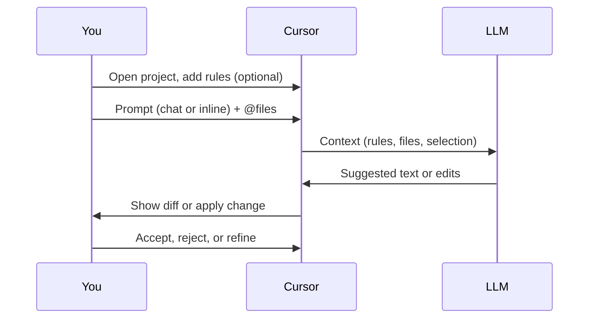

# Using LLMs and Cursor to Code — Guide

This guide explains how to use **LLMs** (large language models) and **Cursor** together to write, edit, and understand code in your project.

---

## Overview

Cursor is a code editor (based on VS Code) that integrates **LLMs** so you can get completions, ask questions in natural language, and request edits across files. You describe what you want; the model suggests or applies code while respecting your project’s rules and style.

**Purpose:** Code faster and more consistently by offloading boilerplate, refactors, and exploration to the AI, while you stay in control of design and review.

---

## Key Concepts

| Term | Description |
|------|-------------|
| **LLM** | Large language model; predicts text (including code) from context and your instructions. |
| **Cursor** | Editor that wires LLMs into editing, chat, and inline completion. |
| **Rules** | Project-specific instructions in `.cursor/rules/*.mdc` that the AI reads (e.g. style, patterns, when to run tests). |
| **Chat / Composer** | Cursor’s interfaces for multi-turn conversation and multi-file edits. |

---

## How Cursor and the LLM Work Together

- **Your context**: Open files, selection, and (optionally) rules in `.cursor/rules/` define what the model “sees.”
- **Your prompt**: You ask a question or request a change in plain language or with @-references (e.g. `@file.py`, `@.cursor/rules/my_readme_style.mdc`).
- **Model output**: Suggestions in chat, diffs in the editor, or direct edits when you accept them.

**Sequence view (you ↔ Cursor ↔ LLM):**

---

## Cursor Rules (Project Instructions)

Rules tell the AI how to behave in *this* repo. They live under `.cursor/rules/` as `.mdc` files with optional YAML frontmatter.

### Rule file structure

| Part | Purpose |
|------|---------|
| **Frontmatter** | `description`, `globs`, `alwaysApply` — when the rule applies (e.g. only for `**/*.py` or always). |
| **Body** | Markdown: headings, lists, tables, and examples that describe style, patterns, or constraints. |

- **Same-folder script**: Refer to the script in backticks — e.g. "See `my_script.py` for the entry point."
- **Other files**: Use a link — e.g. See [`.cursor/rules/my_readme_style.mdc`](../.cursor/rules/my_readme_style.mdc) for README conventions.

### When rules apply

- **`alwaysApply: true`** — The rule is included in every request.
- **`globs: ["**/*.py"]`** — The rule is included when you have matching files open or in context.

---

## Usage Instructions

### Prerequisites

- **Cursor** installed and signed in.
- Your project opened in Cursor (so the AI can use repo context and rules).

### Setup

1. **Open your project** in Cursor (File → Open Folder).

2. **Add or edit rules** (optional but recommended):
   - Create or edit files in `.cursor/rules/`, e.g. `my_readme_style.mdc`, `coding_style.mdc`.
   - Use `description` and `globs` so the right rule applies when you work on READMEs, Python, etc.

3. **Reference rules when prompting** — e.g. "Following @.cursor/rules/my_readme_style.mdc, draft a README for this script."

### Using Chat and Composer

- **Chat**: Ask questions, request explanations, or ask for a single change. Use **@** to attach files, folders, or rules so the model has precise context.
- **Composer**: Request multi-file edits (e.g. "Add a tests for `api_client.py` and update the README"). The model can propose changes across several files; review diffs before accepting.
- **Inline edit**: Select code, then use the inline prompt to refine, translate, or replace the selection.

### What you’ll see

- **Chat**: Streaming replies with optional code blocks; you can copy or apply edits.
- **Composer**: Diffs per file; you accept, reject, or ask for follow-up changes.
- **Inline**: Inline suggestion or replacement for the selection.

To get better results: be specific, attach the files that matter with **@**, and point to a rule when you want a particular style (e.g. "Use the style in @my_readme_style.mdc").

---

## Example Prompts

**Clarify before changing:**

- "What does this function do, and what could break if we change the default value?"

**Request an edit that follows project style:**

- "Refactor this to use a list comprehension. Follow @.cursor/rules/coding_style.mdc."

**Documentation:**

- "Using @.cursor/rules/my_readme_style.mdc, write a short README for `scripts/fetch_data.py` that includes overview, usage, and a Mermaid diagram of the flow."

**Multi-step:**

- "Add a `tests/` folder, add a test for `utils.py::validate_input`, and run pytest. Show me the command and any changes to the code."

---

## Checklist for This Workflow

When using LLMs and Cursor to code, keep in mind:

- [ ] **Context**: Open or @-reference the files and rules that define the task.
- [ ] **Rules**: Put project conventions in `.cursor/rules/*.mdc` and reference them in prompts when you care about style or structure.
- [ ] **Review**: Always review diffs and suggestions before accepting; run tests or lint after applying edits.
- [ ] **Prompts**: Be specific (what to change, where, and any constraints); reference filenames and rule files by name or @.
