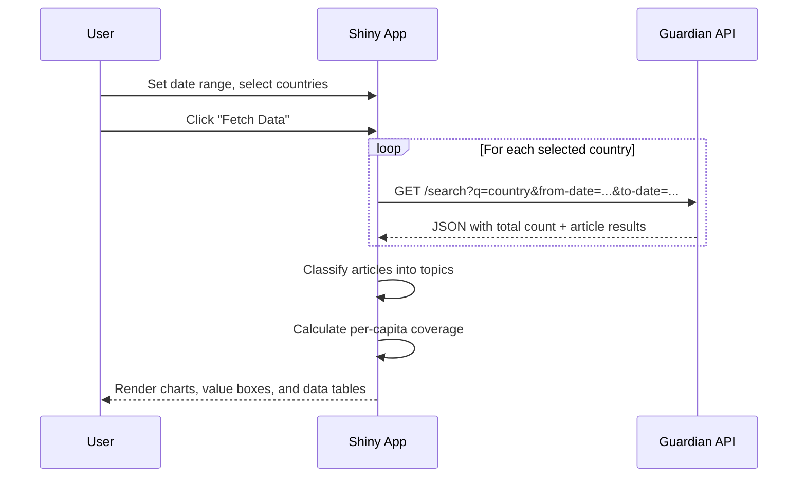

# Guardian Geographic Attention Dashboard — App Documentation

Documentation for `app.py`: a Shiny for Python dashboard that queries The Guardian API to visualize which countries receive the most news coverage, what topics dominate each country's coverage, and how coverage compares on a per-capita basis.

---

## Overview

This app builds on the query logic from [`04_geographic_attention.py`](../../01_query_api/04_geographic_attention.py) and turns it into a fully interactive dashboard. It searches The Guardian's `/search` endpoint for articles mentioning each selected country, then classifies articles into broad topics (Politics, Culture, Crisis, Sport, Business, Science) and calculates per-capita coverage using built-in population data.

**Purpose:** Provide an interactive tool for exploring geographic patterns in Guardian news coverage — which countries get the most attention, what kind of stories drive that attention, and how coverage scales relative to population size.

**Key features:**

- **Sidebar controls** for date range and country selection
- **Value boxes** summarizing total articles, countries analyzed, and the most-covered country
- **Article Count by Country** — horizontal bar chart ranked by total articles
- **Coverage Per Capita** — articles per 1 million population, highlighting smaller countries that punch above their weight
- **Topic Breakdown by Country** — stacked bar chart showing Politics vs. Culture vs. Crisis vs. Sport vs. Business vs. Science vs. Other
- **Overall Topic Distribution** — donut chart of topic share across all countries
- **Filterable data tables** for both summary statistics and individual article details

---

## API Endpoint and Parameters

The app uses The Guardian Open Platform REST API (Representational State Transfer).

| Item | Value |
|------|-------|
| **Base URL** | `https://content.guardianapis.com` |
| **Endpoint** | `/search` |
| **Method** | `GET` |
| **Auth** | API key passed as `api-key` query parameter |

### Parameters used by the app

| Parameter | Required | Description |
|-----------|----------|-------------|
| `q` | Yes | Search query — the country name (e.g. `"United States"`) |
| `from-date` | Yes | Start of date range (`YYYY-MM-DD`), set by the sidebar date picker |
| `to-date` | Yes | End of date range (`YYYY-MM-DD`), set by the sidebar date picker |
| `page-size` | No | Number of results per request; the app uses `50` |
| `show-fields` | No | Extra fields to include; the app requests `headline,trailText,wordcount` |
| `api-key` | Yes | Your Guardian API key, loaded from the `.env` file |

**Example request:**

```
https://content.guardianapis.com/search?q=Japan&from-date=2026-01-09&to-date=2026-02-08&page-size=50&show-fields=headline,trailText,wordcount&api-key=YOUR_KEY
```

Replace `YOUR_KEY` with your actual Guardian API key.

---

## Data Structure

### API response fields used

| Field | Type | Description |
|-------|------|-------------|
| `response.total` | `integer` | Total matching articles for the query (used for country-level counts) |
| `response.results[].webTitle` | `string` | Article headline |
| `response.results[].sectionId` | `string` | Machine-readable section identifier (e.g. `world`, `sport`) |
| `response.results[].sectionName` | `string` | Human-readable section name |
| `response.results[].webPublicationDate` | `datetime` | Publication timestamp |
| `response.results[].webUrl` | `string` | Link to the article on The Guardian |

### Topic classification

The app maps Guardian `sectionId` values to six broad topics:

- **Politics** — `politics`, `world`, `us-news`, `uk-news`, `australia-news`, `law`, `global`
- **Culture** — `culture`, `music`, `film`, `books`, `artanddesign`, `stage`, `tv-and-radio`, `games`, `food`
- **Crisis** — `environment`, `global-development`, `society`, `inequality`
- **Sport** — `sport`, `football`, `cricket`, `rugby-union`, `tennis`, `cycling`, `formulaone`
- **Business** — `business`, `technology`, `money`, `media`
- **Science** — `science`, `lifeandstyle`, `education`
- **Other** — anything not listed above

### Per-capita calculation

Coverage per capita is calculated as **total articles / population (in millions)**. Population figures (approximate 2024 values) are embedded in the app for the ten default countries.

---

## App Flow

**Sequence view (user, app, Guardian API):**



---

## Usage Instructions

### Prerequisites

- **Python 3.9+** with the following packages: `shiny`, `pandas`, `plotly`, `requests`, `python-dotenv`
- A **Guardian API key** — register for free at [The Guardian Open Platform](https://open-platform.theguardian.com/access/)

### Setup

1. **Install dependencies:**

```bash
pip install -r requirements.txt
```

The `requirements.txt` file in this folder includes all needed packages.

2. **Set up your API key.** Add your Guardian API key to the `.env` file in the **project root** (two levels up from this app folder):

```
GUARDIAN_API_KEY=your_key_here
```

The app automatically resolves the `.env` path relative to its own location, so no extra configuration is needed.

3. **Verify the `.env` is in place.** The file should be at the repository root (the same folder that contains `01_query_api/`, `02_productivity/`, etc.).

### Running the app

From the project root:

```bash
shiny run 02_productivity/app/app.py
```

Or from inside the `app/` folder:

```bash
shiny run app.py
```

The terminal will display a local URL (typically `http://127.0.0.1:8000`). Open it in your browser.

### What you'll see

1. **On load** — the dashboard displays placeholder text ("Click 'Fetch Data' to load results") and empty value boxes.
2. **After clicking "Fetch Data"** — the app queries The Guardian for each selected country. This takes a few seconds depending on how many countries are selected. Once complete, all six cards and three value boxes update with live data.
3. **Adjusting inputs** — change the date range or toggle countries on/off in the sidebar, then click **Fetch Data** again to refresh. The action button prevents unnecessary API calls while you adjust settings.

### Screenshots

*After running the app, take screenshots of:*

- [ ] The full dashboard with charts populated
- [ ] The sidebar showing input controls
- [ ] The data tables with filters applied

*(Add your screenshots here after running the app.)*

### Customization

- **Add countries**: Edit the `COUNTRIES` list and `POPULATIONS` dict near the top of `app.py`.
- **Change topic categories**: Edit the `TOPIC_MAP` dict to reclassify Guardian sections.
- **Adjust sample size**: Change the `page-size` parameter in the `query_guardian` function (max `200` per the Guardian API).

---

## File Structure

```
02_productivity/app/
├── app.py              # Main Shiny Express application
├── requirements.txt    # Python dependencies
└── README.md           # This file
```

---

## Troubleshooting

- **"GUARDIAN_API_KEY not found"** — Make sure your `.env` file exists at the project root and contains `GUARDIAN_API_KEY=your_key`. Restart the app after adding it.
- **No data returned** — Check that your API key is valid by testing a request in your browser: `https://content.guardianapis.com/search?q=test&api-key=YOUR_KEY`. Also verify the date range is reasonable (the Guardian API may return few results for very narrow ranges).
- **Slow loading** — Each country requires a separate API request. Deselect countries you don't need to speed things up.
- **Import errors** — Run `pip install -r requirements.txt` to ensure all dependencies are installed.
