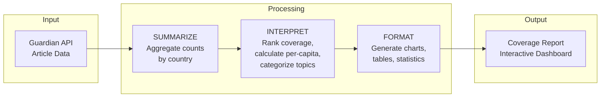
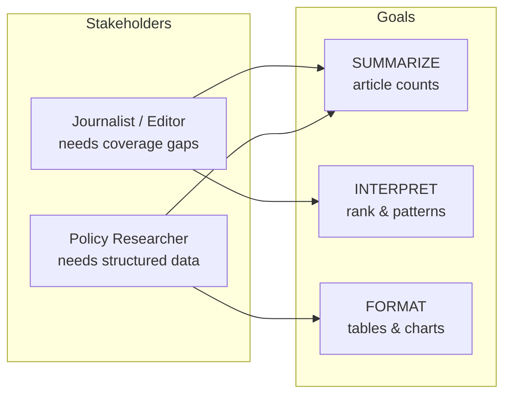

# Global News Attention Tracker

**Tool Name:** Global News Attention Tracker — Transforms Guardian API article data into geographic coverage reports showing which countries dominate news attention.

---

## Process Diagram

---

## What the AI Returns

| Step | Function | Output |
|------|----------|--------|
| 1 | **SUMMARIZE** | Article counts per country, total coverage volume |
| 2 | **INTERPRET** | Rankings, per-capita metrics, topic breakdown, coverage gaps |
| 3 | **FORMAT** | Bar charts, pie charts, data tables, summary statistics |

---

## Stakeholders & Needs

| Stakeholder | Need |
|-------------|------|
| **Journalist / Editor** | Identify geographic blind spots in publication coverage |
| **Policy Researcher** | Structured country-level media attention data for analysis |

---

## Needs → Goals Mapping

---

## Tool Summary

| Category | Input → Output | Core Functions |
|----------|----------------|----------------|
| **Global News Attention Tracker** | Guardian API → Country coverage dashboard | SUMMARIZE, INTERPRET, FORMAT |

---

## Files

| File | Description |
|------|-------------|
| `03_guardian_api.py` | Basic Guardian API query (single article) |
| `04_geographic_attention.py` | Multi-country coverage analysis script |
| `../02_productivity/app/app.py` | Interactive Shiny dashboard |
