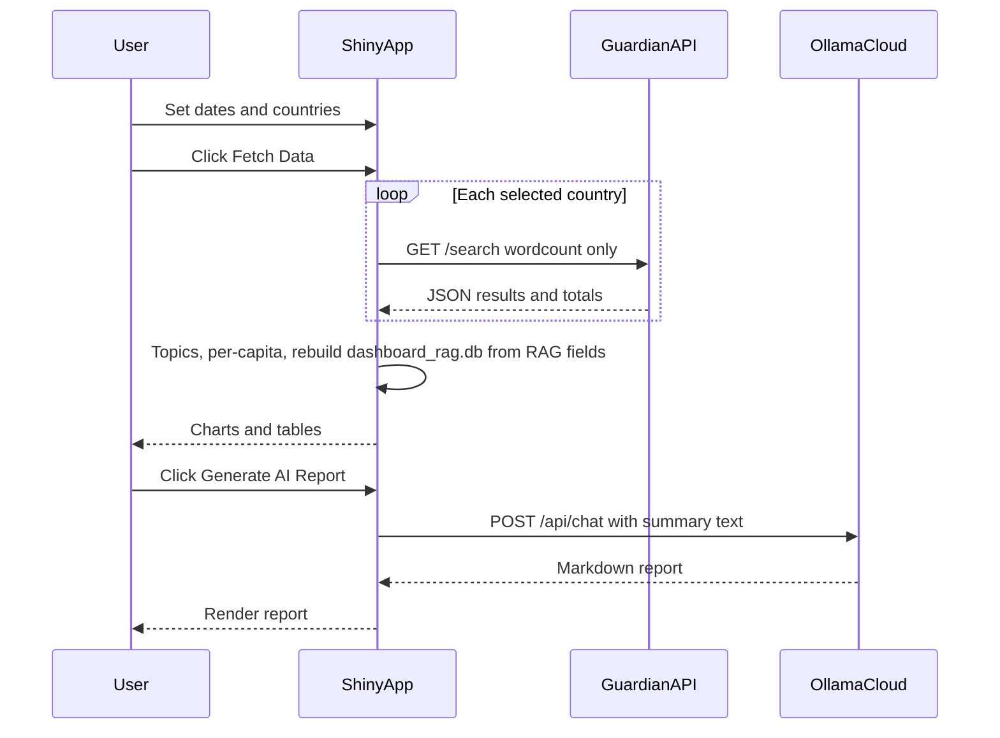
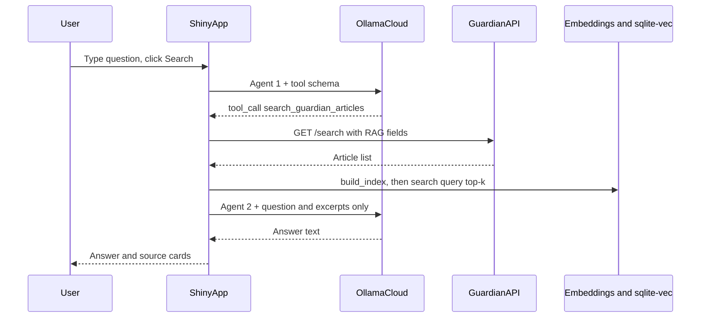
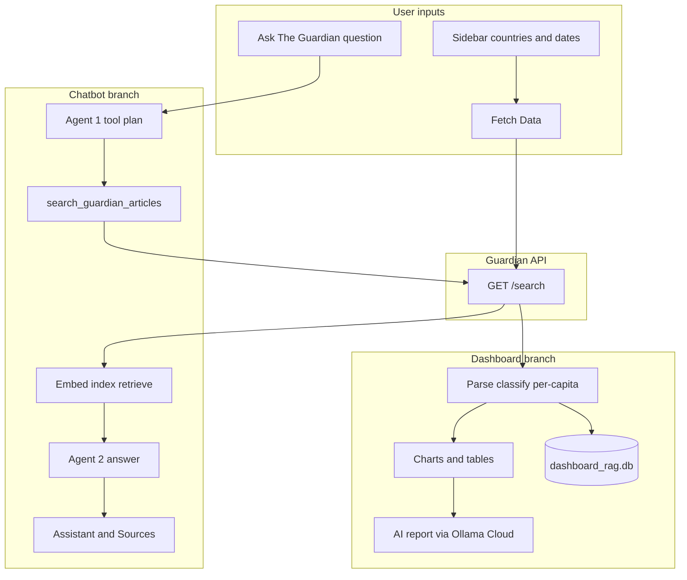

# Geographic Attention Reporter

Shiny app that analyzes **The Guardian Open Platform** API data: country coverage charts, an **Ollama Cloud** narrative report, and **Ask The Guardian** (multi-agent flow with **tool calling** and **RAG**). Full technical reference, diagrams, and usage are below.

**Quick links for assignments:** [Process diagrams (Mermaid)](#process-diagrams) · [System architecture](#system-architecture) · [RAG and tools](#rag-and-tool-implementation) · [Technical details](#technical-details) · [Usage](#usage) · [Deployment](#deployment-posit-connect-or-similar)

---

## Table of contents

1. [What the app does and who it is for](#what-the-app-does-and-who-it-is-for)
2. [Process diagrams](#process-diagrams)
3. [System architecture](#system-architecture)
4. [RAG and tool implementation](#rag-and-tool-implementation)
5. [Technical details](#technical-details)
6. [Usage](#usage)
7. [Deployment (Posit Connect or similar)](#deployment-posit-connect-or-similar)
8. [Error handling and troubleshooting](#error-handling-and-troubleshooting)

---

## What the app does and who it is for

The Geographic Attention Reporter is a **Shiny for Python** dashboard built around **The Guardian Open Platform**. The main idea is to measure how much attention The Guardian pays to different countries over a window you choose, then visualize it and optionally narrate it with a cloud language model. You are not scraping the site yourself. You are calling their documented **REST** endpoint with an API key, the same way a small analytics product would.

In the **sidebar** you pick up to **ten countries** (United States, United Kingdom, China, India, Russia, Brazil, Germany, France, Australia, Japan) and a **from date** and **to date**. When you click **Fetch Data**, the app loops over each selected country and issues **`GET https://content.guardianapis.com/search`** with **`q`** set to the country name, your dates, **`page-size` 50**, and **`show-fields=wordcount`** for the chart pipeline. The JSON gives you titles, sections, publication dates, URLs, and word counts. The app maps each article **`sectionId`** into six coarse **topics** (Politics, Culture, Crisis, Sport, Business, Science) plus Other, and it joins each country to a **population in millions** stored in code so it can compute **articles per million people**. That per capita view matters because otherwise a country with a huge population almost always wins on raw counts even when coverage intensity is low.

The **dashboard** renders **value boxes** (totals, how many countries, who leads), horizontal **bar charts** for volume and per capita, **stacked** topic bars by country, a **pie** of overall topic mix, and **filterable tables** for the summary grid and sample article rows. There is a small **JavaScript** workaround so the first **Fetch Data** click effectively fires twice; without it some **Plotly** outputs did not see data on the first reactive pass in our tests.

After a successful fetch, the app runs a **second** Guardian pass for the same countries and dates with **`show-fields`** expanded to **`wordcount,trailText,headline,shortUrl`**. Those rows feed **sentence-transformers** (`all-MiniLM-L6-v2`) and **sqlite-vec** to build **`dashboard_rag.db`**, a vector index of headline plus trail text for semantic search over the sidebar window. If your **first** action is **Ask The Guardian** instead of fetch, the app can still create that file **once** from whatever is currently in the sidebar, so the on-disk RAG index is not stuck behind the button order.

**Generate AI Report** does not use RAG. It formats the **aggregated dashboard statistics** into a long prompt and sends one **Ollama Cloud** chat completion (**`gpt-oss:20b-cloud`**) with instructions for formal tone, concrete percentages, and two substantive insights. That is aimed at **journalists and editors** who want a readable memo from the same numbers the charts show, **policy or media researchers** who want a structured starting point for memos or methods sections, and **students** who need to show they can connect an API, a UI, and an LLM responsibly in one artifact.

**Ask The Guardian** is intentionally **decoupled** from the sidebar dates. You type a question such as what happened in US basketball last week. **Agent 1** is a system prompt plus your text sent to Ollama with **tool metadata** for **`search_guardian_articles`**. The model returns a **tool call** with **`country`**, **`from_date`**, and **`to_date`** as strings. **Python** executes the real function, which calls **`rag_guardian.query_guardian`**, so the network request always matches what the tool arguments say. Returned articles are embedded into an **in-memory** SQLite vec database for that question only, then **`search(..., k=5)`** retrieves the passages closest to your full question embedding so the model can focus on basketball even though the Guardian **`q`** parameter was only the country. **Agent 2** receives the question plus those excerpts and writes the visible answer; the UI lists **Sources** with links. The analyst prompt asks for **no inline citation clutter** so the prose stays readable while accountability stays in the source list.

Together, the dashboard answers **who got how much coverage in my chosen window**, the AI report adds **interpretive language tied to those aggregates**, and Ask The Guardian adds **ad hoc grounding** over real article text for a different time and place without redoing the whole sidebar workflow each time.

---

## Process diagrams

These **Mermaid** figures are digital diagrams of data flow, including **agentic orchestration** (two cloud calls, tool execution) and **RAG plus tool calling**. Render them in GitHub, VS Code, or [mermaid.live](https://mermaid.live), then **screenshot or export to PNG** if your instructor wants an image file in the submission (the source stays here in the repo).

### Dashboard path (fetch, charts, AI report)



### Ask The Guardian path (agents, tool, RAG)



### High-level combined flow



---

## System architecture

| Piece | File | Role |
|-------|------|------|
| Main app | `app.py` | Shiny UI, `fetch_data`, `run_guardian_chatbot`, dashboard RAG lifecycle |
| Cloud + tools | `agent_workflow.py` | `cloud_agent` / `cloud_agent_run` POST to Ollama; **`search_guardian_articles`** and tool JSON; optional CLI demo with **`get_guardian_coverage`** |
| RAG core | `rag_guardian.py` | `query_guardian`, `embed`, `build_index`, `search`, `reset_rag_schema`, `connect_db`; optional terminal script |

**Agent 1** turns free text into one structured **Guardian** query via a **tool call** executed in Python. **Agent 2** is a plain chat completion over **retrieved chunks** only. Orchestration is **two sequential cloud calls** in `run_guardian_chatbot`, not a single monolithic prompt.

---

## RAG and tool implementation

**Data source:** Guardian `GET https://content.guardianapis.com/search` with `q` = country, date range, `page-size` 50. Dashboard rows use `show-fields=wordcount`. RAG uses **`wordcount,trailText,headline,shortUrl`**. Each stored chunk is **`headline` + pipe + cleaned `trail_text`**. **Model:** `all-MiniLM-L6-v2` (384 dims). **Store:** SQLite + **sqlite-vec** (`vec_chunks` + `chunks` metadata). **Search:** `rag_guardian.search(conn, query, k=5)` cosine-style distance, returns scored rows with URLs. **Chatbot** uses an in-memory DB per question; **dashboard** uses **`dashboard_rag.db`** after Fetch Data or after the first successful Search if Fetch never ran (lazy seed from sidebar).

| Tool | Purpose | Parameters | Returns |
|------|---------|------------|---------|
| `search_guardian_articles` | Feed chatbot RAG | `country`, `from_date`, `to_date` (YYYY-MM-DD); country must be one of the ten in the app | `list` of article dicts, or `[{error: ...}]` |
| `get_guardian_coverage` | CLI demo only in `agent_workflow.py` | Same three strings | `DataFrame` of topic counts and percentages |

Tool schemas the LLM sees live in **`agent_workflow.py`** as `tool_search_guardian_articles` and `tool_get_guardian_coverage`.

---

## Technical details

| Topic | Detail |
|-------|--------|
| **Guardian** | `GET https://content.guardianapis.com/search`, query param **`api-key`** |
| **Ollama Cloud** | `POST https://ollama.com/api/chat`, header **`Authorization: Bearer`** + **`OLLAMA_API_KEY`** |
| **Env vars** | Repo root **`.env`**: `GUARDIAN_API_KEY`, `OLLAMA_API_KEY` (on **Posit Connect**, set the same names in the publisher **Environment** tab) |
| **Packages** | `shiny`, `pandas`, `plotly`, `requests`, `python-dotenv`, `python-dateutil`, `sentence-transformers`, `sqlite-vec` |
| **Deployment platform** | **Posit Connect** (or any host that runs Shiny for Python); bundle via **`manifest.json`** + `rsconnect deploy` (see [Deployment](#deployment-posit-connect-or-similar)) |

**Layout**

```
dsai/.env
04_deployment/app/
  app.py
  rag_guardian.py
  agent_workflow.py
  requirements.txt
  manifest.json          # Posit Connect bundle list
  dashboard_rag.db       # created at runtime (optional gitignore)
  README.md
```

---

## Usage

1. `cd 04_deployment/app` then `pip install -r requirements.txt` (first embedding run may download the model).
2. Put **`GUARDIAN_API_KEY`** and **`OLLAMA_API_KEY`** in **`dsai/.env`** (parent of `04_deployment`).
3. `shiny run app.py` and open the printed URL (often port 8000).
4. **Fetch Data** for charts; **Generate AI Report** for the dashboard summary LLM; **Ask The Guardian** for the agent + RAG flow.

**Deployed app:** Use the URL your host gives you (for example Posit Connect). Log in with whatever credentials your school or admin assigned. This project does not ship a built-in app password; if the deployment is public, treat the Guardian and Ollama keys as secrets on the server only.

---

## Deployment (Posit Connect or similar)

- Include **`app.py`**, **`rag_guardian.py`**, and **`agent_workflow.py`** in the bundle (regenerate **`manifest.json`** with `rsconnect write-manifest shiny . --overwrite` from the app folder).
- Set **`GUARDIAN_API_KEY`** and **`OLLAMA_API_KEY`** in the Connect environment variable UI, not only in local `.env`.
- **`sqlite-vec`** and **`sentence-transformers`** must install on the server image; builds can differ from Windows.

---

## Error handling and troubleshooting

| Situation | What usually fixes it |
|-----------|-------------------------|
| Missing Guardian key | Red banner; add key and restart |
| Missing Ollama key | Warning; AI features return errors |
| Charts empty first click | Known Shiny quirk; **Fetch Data** auto double-clicks once |
| Chat planner fails | Name a valid country and a clearer time window |
| `No module named rag_guardian` on Connect | Bundle all three Python files; `app.py` adds its folder to `sys.path` |

---

*Stack: Shiny for Python, Plotly, sentence-transformers, sqlite-vec, Ollama Cloud, The Guardian Open Platform.*
