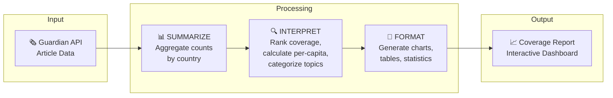
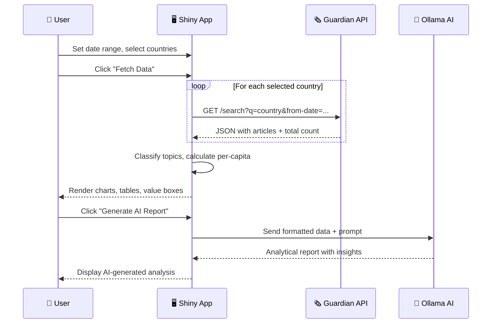
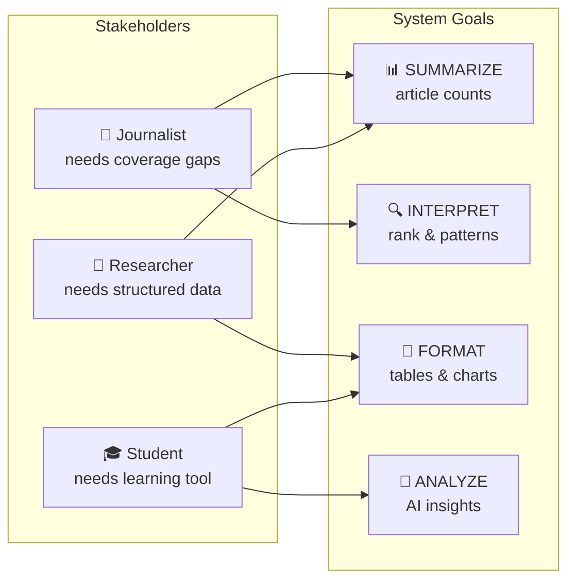

# 🌍 Geographic Attention Reporter

> **An AI-powered news analysis tool that reveals which countries dominate media attention and why.**

This integrated Shiny application queries The Guardian API for global news coverage, visualizes geographic patterns through interactive charts, and uses a local AI model (Ollama) to generate analytical insights.

---

## 📋 Table of Contents

- [What This Tool Does](#-what-this-tool-does)
- [How It Works](#-how-it-works)
- [Stakeholders and Use Cases](#-stakeholders-and-use-cases)
- [Data Summary](#-data-summary)
- [Technical Details](#-technical-details)
- [Usage Instructions](#-usage-instructions)
- [Error Handling](#-error-handling)
- [Troubleshooting](#-troubleshooting)

---

## 🎯 What This Tool Does

This app is a news coverage analyzer that pulls article data from The Guardian API and shows you how different countries are getting media attention. It lets you pick which countries and date range you want to look at, then fetches the data and displays it through interactive charts like bar graphs for raw article counts and per-capita coverage, plus pie charts showing topic breakdowns. The cool part is it also connects to a local AI model called Ollama that can read all that data and write up an analytical report with actual insights instead of just repeating the numbers back at you.

### Three Core Capabilities

| Lab | Feature | What It Does |
|:---:|---------|--------------|
| 🔌 LAB 1 | **API Integration** | Queries The Guardian for articles mentioning 10 countries |
| 📊 LAB 2 | **Shiny Dashboard** | Interactive charts, tables, and value boxes |
| 🤖 LAB 3 | **AI Reporting** | Generates analytical insights using Ollama LLM |

### Dashboard Components

- 📦 **Value Boxes** — Total articles, countries analyzed, most covered country
- 📊 **Bar Charts** — Article count by country, per-capita coverage comparison
- 🥧 **Topic Analysis** — Stacked bar chart and pie chart showing topic distribution
- 📋 **Data Tables** — Filterable summary and article tables
- 🤖 **AI Report** — Generated analysis with statistics, insights, and implications

---

## ⚙️ How It Works

### Process Flow



### User Interaction Sequence



### What the System Returns

| Step | Function | Output |
|:----:|----------|--------|
| 1 | **SUMMARIZE** | Article counts per country, total coverage volume |
| 2 | **INTERPRET** | Rankings, per-capita metrics, topic breakdown, coverage gaps |
| 3 | **FORMAT** | Bar charts, pie charts, data tables, summary statistics |
| 4 | **ANALYZE** | AI-generated insights, patterns, and implications |

---

## 👥 Stakeholders and Use Cases

### Who Benefits

| Stakeholder | Need |
|-------------|------|
| 📰 **Journalist / Editor** | Identify geographic blind spots in publication coverage |
| 🔬 **Policy Researcher** | Structured country-level media attention data for analysis |
| 🎓 **Student / Educator** | Learn about media patterns and global news distribution |

### Needs → Goals Mapping



---

## 📊 Data Summary

### Article Data (from Guardian API)

| Column | Data Type | Description |
|--------|:---------:|-------------|
| `country` | string | Country name used in the search query |
| `title` | string | Article headline (`webTitle` from API) |
| `section` | string | Guardian section name (e.g., "World news", "Sport") |
| `section_id` | string | Machine-readable section identifier for topic classification |
| `topic` | string | Derived category: Politics, Culture, Crisis, Sport, Business, Science, Other |
| `pillar` | string | Guardian pillar: News, Opinion, Sport, Arts, Lifestyle |
| `wordcount` | integer | Article word count (indicates depth of coverage) |
| `date` | string | Publication date in YYYY-MM-DD format |
| `url` | string | Full URL to the article on The Guardian website |

### Summary Data (computed by app)

| Column | Data Type | Description |
|--------|:---------:|-------------|
| `country` | string | Country name |
| `total_articles` | integer | Total articles mentioning the country |
| `population_m` | float | Country population in millions (reference data) |
| `articles_per_1m` | float | Coverage intensity: articles per million people |

### Topic Classification

The app maps Guardian `sectionId` values to six broad topics:

| Topic | Sections Included |
|-------|-------------------|
| 🏛️ **Politics** | politics, world, us-news, uk-news, australia-news, law, global |
| 🎭 **Culture** | culture, music, film, books, artanddesign, stage, tv-and-radio, games, food |
| ⚠️ **Crisis** | environment, global-development, society, inequality |
| ⚽ **Sport** | sport, football, cricket, rugby-union, tennis, cycling, formulaone |
| 💼 **Business** | business, technology, money, media |
| 🔬 **Science** | science, lifeandstyle, education |
| 📰 **Other** | Anything not listed above |

---

## 🔧 Technical Details

### API Configuration

| Setting | Value |
|---------|-------|
| **Provider** | The Guardian Open Platform |
| **Base URL** | `https://content.guardianapis.com/search` |
| **Method** | GET (REST API) |
| **Authentication** | API key as `api-key` query parameter |
| **Rate Limit** | 12 requests/second, 5,000/day (free tier) |

### Query Parameters

| Parameter | Example Value | Purpose |
|-----------|---------------|---------|
| `q` | `"United States"` | Search term (country name) |
| `from-date` | `2026-01-01` | Start of date range |
| `to-date` | `2026-01-31` | End of date range |
| `page-size` | `50` | Max articles per request |
| `show-fields` | `wordcount` | Additional fields to retrieve |
| `api-key` | `your-key-here` | Authentication |

**Example Request:**
```
https://content.guardianapis.com/search?q=Japan&from-date=2026-01-01&to-date=2026-01-31&page-size=50&show-fields=wordcount&api-key=YOUR_KEY
```

### Ollama AI Configuration

| Setting | Value |
|---------|-------|
| **Host** | `http://localhost:11434` |
| **Endpoint** | `/api/generate` |
| **Model** | `gemma3:latest` |
| **Timeout** | 120 seconds |

### AI Prompt Design

| Element | Description |
|---------|-------------|
| **Role** | Media analyst specializing in global news coverage |
| **Chain-of-Thought** | 6-step reasoning: volume → per-capita → depth → tone → factors → conclusions |
| **Constraints** | Formal language, no hyperbole, specific numbers/percentages |
| **Output Format** | Key Statistics (3-4 bullets), 2 Deep Insights, Implications |

### File Structure
All you need to run this program is .env and 04_deployment/app/
```
dsai/
├── .env                           # 🔑 API keys (GUARDIAN_API_KEY)
├── 01_query_api/
│   ├── 03_guardian_api.py         # Basic Guardian API query
│   └── 04_geographic_attention.py # Multi-country analysis script
├── 02_productivity/
│   └── app/
│       └── app.py                 # Shiny dashboard (no AI)
├── 03_query_ai/
│   ├── 06_ai_reporter.py          # AI reporting script
│   └── README_geographic_attention.md
└── 04_deployment/
    └── app/
        ├── app.py                 # 🚀 Main integrated application
        ├── requirements.txt       # Python dependencies
        └── README.md              # This documentation
```

### Dependencies

| Package | Purpose |
|---------|---------|
| `shiny` | Web application framework |
| `pandas` | Data manipulation and aggregation |
| `plotly` | Interactive chart visualizations |
| `requests` | HTTP requests to Guardian API and Ollama |
| `python-dotenv` | Load API key from .env file |
| `python-dateutil` | Date calculations (relativedelta) |

---

## 🚀 Usage Instructions

### Prerequisites Checklist

- [ ] Python 3.9+ installed
- [ ] pip package manager available
- [ ] Guardian API key (free registration)
- [ ] Ollama installed (optional, for AI features)

### Step 1: Install Dependencies

```bash
cd 04_deployment/app
pip install -r requirements.txt
```

**Expected output:** Successfully installed shiny, pandas, plotly, requests, python-dotenv, python-dateutil

### Step 2: Get Your Guardian API Key

1. Go to [open-platform.theguardian.com/access](https://open-platform.theguardian.com/access/)
2. Click **"Register for a developer key"**
3. Fill out the form with your email
4. Check your email for the API key
5. Create a `.env` file in the project root (`dsai/.env`):

```env
GUARDIAN_API_KEY=your_api_key_here
```

### Step 3: Set Up Ollama (Optional)

If you want AI-generated reports:

```bash
# Download Ollama from https://ollama.ai/

# Pull the model (first time only, ~2GB download)
ollama pull gemma3:latest

# Start the server (keep this running in a separate terminal)
ollama serve
```

### Step 4: Run the Application

```bash
cd 04_deployment/app
shiny run app.py
```

**Expected output:**
```
Uvicorn running on http://127.0.0.1:8000
```

Open your browser to `http://localhost:8000`

### Step 5: Use the Dashboard

1. ⚙️ **Set Date Range** — Adjust "From Date" and "To Date" in the sidebar
2. 🌍 **Select Countries** — Check/uncheck countries to analyze (default: all 10)
3. 🔄 **Fetch Data** — Click the "Fetch Data" button to query the API
4. 📊 **Explore Visualizations** — View charts and tables that update automatically
5. 🤖 **Generate AI Report** — Click "Generate AI Report" for LLM-powered analysis

### Quick Test Checklist

After running, verify these work:

- [ ] Value boxes show numbers (not dashes)
- [ ] Bar charts display colored bars
- [ ] Pie chart shows topic distribution
- [ ] Data tables are populated and filterable
- [ ] AI report generates (if Ollama is running)

---

## 🛡️ Error Handling

The application handles errors gracefully with visual feedback:

| Error Type | Visual Indicator | What Happens |
|------------|------------------|--------------|
| 🔴 Missing API key | Red alert banner | Queries disabled until .env is configured |
| 🔴 Invalid API key | Red error in charts | 401 status message displayed |
| 🔴 Rate limit exceeded | Red error in charts | 429 status with retry suggestion |
| 🔴 Network timeout | Red error in charts | 15-second timeout with retry message |
| 🟡 Partial failures | Yellow warning banner | Shows which countries failed and why |
| 🔴 Ollama not running | Error in AI section | Friendly instructions to start Ollama |
| 🔴 Date range invalid | Red error in charts | Message to fix from/to dates |

---

## 🔍 Troubleshooting

| Issue | Solution |
|-------|----------|
| **"GUARDIAN_API_KEY not found"** | Create `.env` file in `dsai/` folder with `GUARDIAN_API_KEY=your_key` |
| **"Could not connect to Ollama"** | Run `ollama serve` in a separate terminal window |
| **"Model not found"** | Run `ollama pull gemma3:latest` to download the model |
| **Charts show "Click Fetch Data"** | Click the blue "Fetch Data" button in the sidebar |
| **Only some countries loaded** | Check the yellow warning banner for specific errors |
| **Slow AI response** | Normal — Ollama may take 30-60 seconds on first generation |
| **Import errors when running** | Run `pip install -r requirements.txt` in the app folder |
| **Port 8000 in use** | Run `shiny run app.py --port 8001` to use a different port |

---

## 📚 Data Sources

| Source | Usage |
|--------|-------|
| [The Guardian Open Platform API](https://open-platform.theguardian.com/) | News article data |
| Wikipedia (2024 figures) | Country population estimates |
| Ollama / Gemma 3 | AI-generated analysis |

---


*Built with Shiny for Python, Plotly, and Ollama*
