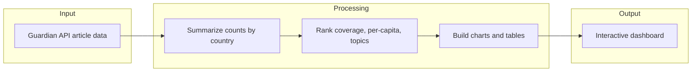
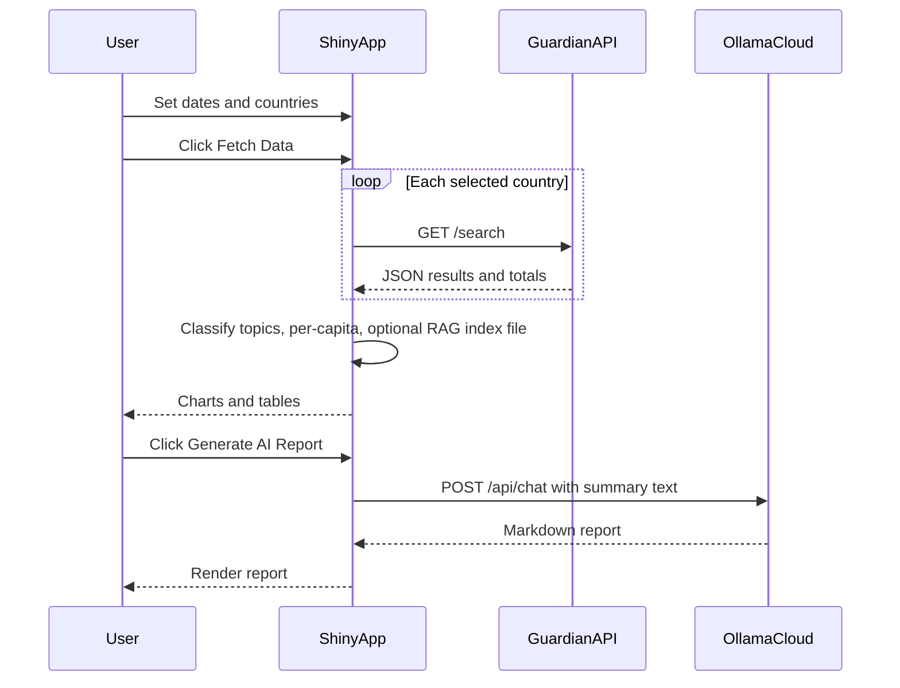
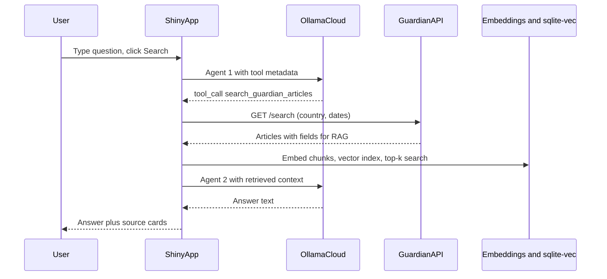
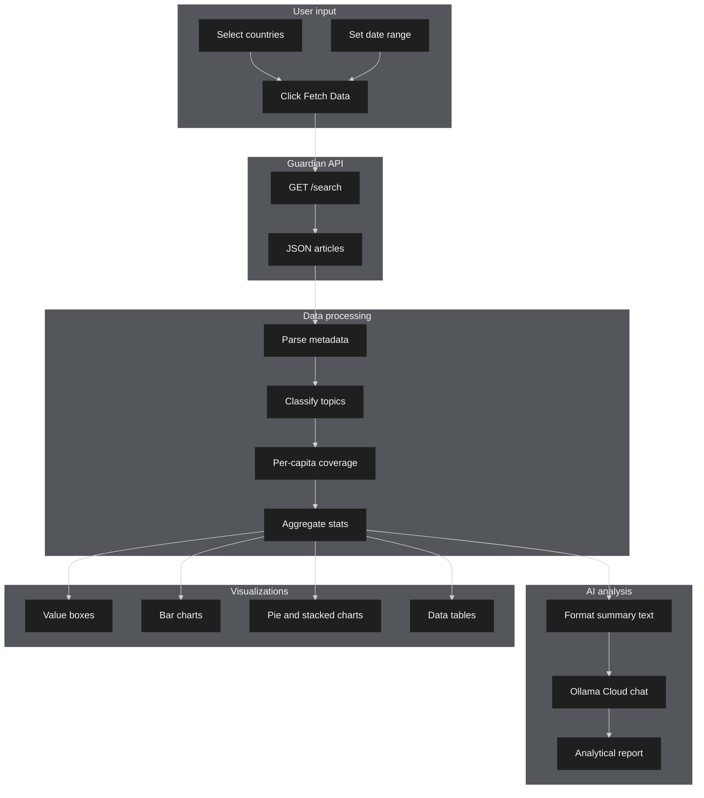

# Geographic Attention Reporter

> **An AI-powered news analysis tool that reveals which countries dominate media attention and why, with an optional natural-language Q&A layer over Guardian articles.**

This Shiny application queries The Guardian API, visualizes geographic coverage, generates an AI report through **Ollama Cloud**, and includes **Ask The Guardian**: a multi-step workflow that uses **function calling**, **retrieval-augmented generation (RAG)**, and **semantic search** over fetched articles.

---

## Table of contents

- [What this tool does](#what-this-tool-does)
- [Extended system description](#extended-system-description-project-write-up)
- [How it works](#how-it-works)
- [System architecture (agents and RAG)](#system-architecture-agents-and-rag)
- [RAG data source](#rag-data-source)
- [Tool functions](#tool-functions)
- [Stakeholders and use cases](#stakeholders-and-use-cases)
- [Data summary](#data-summary)
- [Technical details](#technical-details)
- [Usage instructions](#usage-instructions)
- [Error handling](#error-handling)
- [Troubleshooting](#troubleshooting)
- [Data sources](#data-sources)

---

## What this tool does

This app is a news coverage analyzer that pulls article data from The Guardian API and shows how different countries get media attention. You pick countries (ten options including the US, UK, China, and Australia) and a date range, then it fetches articles that mention those countries and shows interactive charts: bar charts for raw counts and per-capita coverage (so smaller countries still show up fairly), plus pie and stacked bar charts for topics grouped into Politics, Culture, Crisis, Sport, Business, and Science. The app sends aggregated data to **Ollama Cloud** (`gpt-oss:20b-cloud`) to produce a formal analytical report with percentages and two deep insights, aimed at readers like journalists or researchers.

**Ask The Guardian** sits at the top of the page: you ask a question in plain English with your *own* country and time window (for example last week or yesterday). That flow does **not** use the sidebar dates. An LLM plans the request, calls a tool to fetch matching Guardian articles, embeds them, runs **semantic search**, then a second LLM answers using only the retrieved excerpts. **Sources** (headlines and links) appear below the answer; the answer text is prompted to stay free of inline citation markers.

### Core capabilities

| Area | Feature | What it does |
|------|---------|--------------|
| API | **Guardian integration** | GET `/search` per country and date range |
| Dashboard | **Shiny UI** | Value boxes, Plotly charts, filterable tables |
| AI report | **Coverage analysis** | Cloud LLM reads summarized dashboard data |
| Chatbot | **Multi-agent + RAG** | Tool-based fetch, embeddings, top-k similarity, then analyst LLM |
| Indexing | **Dashboard RAG** | After Fetch Data, builds `dashboard_rag.db` with headline + trail text for the sidebar range |

---

## How it works

### Dashboard data flow



### User sequence (sidebar + AI report)



### Ask The Guardian (multi-agent + RAG)



---

## System architecture (agents and RAG)

| Role | Where it lives | Responsibility |
|------|----------------|----------------|
| **Agent 1 (query planner)** | `app.py` → `run_guardian_chatbot()` | Reads the user question, calls Ollama Cloud with `tool_search_guardian_articles`, receives a tool call, runs `search_guardian_articles` locally |
| **Tool** | `agent_workflow.py` | `search_guardian_articles` wraps `rag_guardian.query_guardian` |
| **RAG pipeline** | `rag_guardian.py` + `app.py` | `build_index`, `search`: sentence-transformers `all-MiniLM-L6-v2`, cosine distance in sqlite-vec |
| **Agent 2 (analyst)** | `app.py` → `run_guardian_chatbot()` | Second `cloud_agent_run` with no tools; user message contains question plus formatted excerpts |
| **Dashboard RAG** | `app.py` → `fetch_data()` | After a successful fetch, aggregates RAG-field articles and writes `dashboard_rag.db` |

Orchestration helpers (`cloud_agent`, `cloud_agent_run`) live in **`agent_workflow.py`** and post to `https://ollama.com/api/chat` with a bearer token.

---

## RAG data source

| Item | Detail |
|------|--------|
| **API** | Same Guardian Open Platform `GET https://content.guardianapis.com/search` |
| **Query** | `q` = country name; `from-date`, `to-date`; `page-size` = 50 |
| **Fields for RAG** | `show-fields=wordcount,trailText,headline,shortUrl` (see `rag_guardian.query_guardian`) |
| **Chunk text** | `headline` + ` \| ` + `trail_text` (HTML stripped from trail) |
| **Embedding model** | `all-MiniLM-L6-v2` (384 dimensions) via `sentence-transformers` |
| **Vector store** | `sqlite-vec` virtual table `vec_chunks`, metadata in `chunks` |
| **Search function** | `rag_guardian.search(conn, query, k=5)` embeds the query and returns the closest rows with scores |
| **Chatbot index** | In-memory SQLite database per question |
| **Dashboard index** | File `04_deployment/app/dashboard_rag.db` after each successful Fetch Data |

---

## Tool functions

| Tool name | Purpose | Parameters | Returns |
|-----------|---------|------------|---------|
| `search_guardian_articles` | Fetch Guardian articles for chatbot RAG (headline, trail, URL, section, date) | `country` (must be one of the ten app countries), `from_date` (YYYY-MM-DD), `to_date` (YYYY-MM-DD) | `list` of article `dict`s, or a one-element list with `error` on failure |
| `get_guardian_coverage` | Standalone demo: topic mix and per-capita summary for one country and range | Same three strings as above | `pandas.DataFrame` of topic counts and percentages (used when you run `python agent_workflow.py`) |

Tool **metadata** (JSON schema for the LLM) is in **`agent_workflow.py`**: `tool_search_guardian_articles`, `tool_get_guardian_coverage`. The chat UI only registers `search_guardian_articles`.

---

## Stakeholders and use cases

| Stakeholder | Need |
|-------------|------|
| Journalist / editor | Spot geographic gaps in coverage |
| Policy researcher | Structured country-level attention metrics |
| Student / educator | Learn how APIs, dashboards, and LLM tooling fit together |

---

## Data summary

Dashboard tables use the columns described in earlier sections (`title`, `topic`, `wordcount`, etc.). RAG rows additionally rely on `headline`, `trail_text`, and `short_url` from the Guardian `show-fields` response.

---

## Technical details

### Guardian API

| Setting | Value |
|---------|-------|
| Base URL | `https://content.guardianapis.com/search` |
| Method | GET |
| Auth | `api-key` query parameter |

Dashboard requests use `show-fields=wordcount`. RAG paths use `wordcount,trailText,headline,shortUrl`.

### Ollama Cloud

| Setting | Value |
|---------|-------|
| URL | `https://ollama.com/api/chat` |
| Auth | `Authorization: Bearer <OLLAMA_API_KEY>` |
| Default model | `gpt-oss:20b-cloud` (set in `app.py` and `agent_workflow.py`) |

### Environment variables (project root `.env`)

```env
GUARDIAN_API_KEY=your_guardian_key
OLLAMA_API_KEY=your_ollama_cloud_key
```

### File structure

```
dsai/
├── .env
└── 04_deployment/
    └── app/
        ├── app.py                 # Main Shiny app, chatbot orchestration, fetch_data + dashboard RAG
        ├── rag_guardian.py        # query_guardian, embed, build_index, search, reset_rag_schema, CLI
        ├── agent_workflow.py      # cloud_agent_run, tools, optional CLI demo
        ├── dashboard_rag.db       # Created after Fetch Data (optional: add to .gitignore)
        ├── requirements.txt
        └── README.md              # This file
```

### Dependencies

| Package | Purpose |
|---------|---------|
| `shiny` | Web app |
| `pandas` | Data frames |
| `plotly` | Charts |
| `requests` | HTTP |
| `python-dotenv` | Load `.env` |
| `python-dateutil` | Dates |
| `sentence-transformers` | Embeddings for RAG |
| `sqlite-vec` | Vector similarity in SQLite |

---

## Usage instructions

### Prerequisites

- Python 3.10+ recommended
- Guardian API key ([open-platform.theguardian.com/access](https://open-platform.theguardian.com/access/))
- Ollama Cloud API key for AI report and Ask The Guardian ([ollama.com](https://ollama.com))

### Install

```bash
cd 04_deployment/app
pip install -r requirements.txt
```

The first time you run anything that embeds text, `sentence-transformers` may download `all-MiniLM-L6-v2` (wait for it to finish).

### Configure `.env`

At the **repository root** (parent of `04_deployment`), create or edit `.env`:

```env
GUARDIAN_API_KEY=your_key_here
OLLAMA_API_KEY=your_ollama_cloud_key_here
```

### Run

```bash
cd 04_deployment/app
shiny run app.py
```

Open the URL Shiny prints (often `http://127.0.0.1:8000`).

### Using the UI

1. **Sidebar** — Set dates and countries, click **Fetch Data** (charts may rely on the app double-click workaround on the first run).
2. **Charts and tables** — Explore coverage.
3. **Generate AI Report** — Summarizes the current fetch using Ollama Cloud.
4. **Ask The Guardian** — Enter a free-form question, click **Search**. Check **Sources** under the answer for links.

### Optional: CLI RAG script

```bash
cd 04_deployment/app
python rag_guardian.py
```

### Optional: standalone agent demo

```bash
cd 04_deployment/app
python agent_workflow.py
```

Uses `get_guardian_coverage` + a second cloud call (imports `df_as_text` from the course `08_function_calling` folder for the demo table).

---

## Error handling

| Situation | What you see |
|-----------|----------------|
| Missing `GUARDIAN_API_KEY` | Red notification; queries blocked |
| Missing `OLLAMA_API_KEY` | Warning notification; AI report and chatbot fail gracefully |
| Guardian 401 / 429 / timeout | Messages in banners or chat result |
| Partial country failures | Yellow warning on dashboard |
| Planner never calls the tool | Chatbot shows a message to name a country and time range |
| RAG index build fails on fetch | Blue info banner with `rag_warning`; charts may still work |

---

## Troubleshooting

| Issue | What to try |
|-------|-------------|
| Chatbot says planner failed | Confirm `OLLAMA_API_KEY`, network, and that your question mentions a valid country name |
| No sources listed | API returned no articles for the inferred dates; rephrase with explicit dates |
| Embedding errors | Reinstall `sentence-transformers` and `sqlite-vec`; ensure disk space |
| `sqlite-vec` load errors on Windows | Install a build that matches your Python version; see package docs |
| Port in use | `shiny run app.py --port 8001` |

---

## Data sources

| Source | Usage |
|--------|--------|
| [The Guardian Open Platform](https://open-platform.theguardian.com/) | Article metadata and text fields |
| Hardcoded population table in `app.py` | Per-capita rates |
| Ollama Cloud | AI report and both chatbot LLM steps |

---

### End-to-end dashboard diagram



*Built with Shiny for Python, Plotly, sentence-transformers, sqlite-vec, and Ollama Cloud.*
