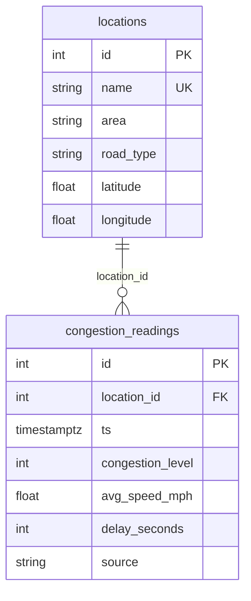

# 📚 Codebook — City Congestion Tracker

> **Definitions and structure of all data used by the City Congestion Tracker: database tables, variables, and API response shapes.**

Use this document to interpret data files, database columns, and API payloads. For system architecture and how to run the app, see [README.md](README.md).

---

## 📋 Table of Contents

- [Data Summary](#-data-summary)
- [Database Schema](#-database-schema)
- [Variable Definitions](#-variable-definitions)
- [Test Datasets](#-test-datasets)
- [API Response Shapes](#-api-response-shapes)

---

## 📊 Data Summary

| Topic | Description |
|-------|-------------|
| 🗺️ **Locations** | **8** fixed road segments or intersections across areas: **Downtown**, **Midtown**, **West Side**, **Uptown**, **East Side**, **Harbor**, **Campus**. Each has a congestion **bias** used when generating synthetic readings. |
| 📈 **Congestion readings** | **Synthetic data only.** One reading every **15 minutes** for the last **30 days**. Patterns: rush-hour spikes (7–9 AM, 4–6 PM), lower weekend congestion, occasional event spikes, random noise. Metrics are consistent: higher congestion → lower speed, higher delay. |
| ⏱️ **Staleness** | “Current” endpoints use a time window (e.g. last 60 minutes). If no data exists in that window, the API **falls back** to the most recent available window and sets `stale: true` and `data_as_of` so the UI can show a notice. |

---

## 🗄️ Database Schema

### Entity Relationship



### Table Definitions

| Table | Purpose |
|-------|---------|
| 📍 **`public.locations`** | One row per road segment or intersection. Identified by `name` (unique). |
| 📉 **`public.congestion_readings`** | Time-series readings per location: congestion level (0–100), speed, delay, timestamp. |

### Recommended Indexes

- `congestion_readings (ts DESC)`
- `congestion_readings (location_id, ts DESC)`
- `congestion_readings (congestion_level DESC)`

### SQL for Schema (Supabase)

Run in the **Supabase SQL editor** if tables do not exist:

```sql
-- Locations: road segments or intersections
CREATE TABLE IF NOT EXISTS public.locations (
    id         SERIAL PRIMARY KEY,
    name       TEXT UNIQUE NOT NULL,
    area       TEXT NOT NULL,
    road_type  TEXT NOT NULL,
    latitude   DOUBLE PRECISION NOT NULL,
    longitude  DOUBLE PRECISION NOT NULL
);

-- Congestion readings (time-series)
CREATE TABLE IF NOT EXISTS public.congestion_readings (
    id                SERIAL PRIMARY KEY,
    location_id       INTEGER NOT NULL REFERENCES public.locations(id),
    ts                TIMESTAMPTZ NOT NULL,
    congestion_level  INTEGER NOT NULL CHECK (congestion_level >= 0 AND congestion_level <= 100),
    avg_speed_mph     DOUBLE PRECISION NOT NULL,
    delay_seconds     INTEGER NOT NULL,
    source            TEXT NOT NULL DEFAULT 'synthetic'
);

CREATE INDEX IF NOT EXISTS idx_readings_ts ON public.congestion_readings (ts DESC);
CREATE INDEX IF NOT EXISTS idx_readings_location_ts ON public.congestion_readings (location_id, ts DESC);
CREATE INDEX IF NOT EXISTS idx_readings_congestion ON public.congestion_readings (congestion_level DESC);
```

---

## 📝 Variable Definitions

### 1. Locations

**Source:** `public.locations` table / [`data/locations_sample.json`](data/locations_sample.json)

| Variable | Type | Description |
|----------|:----:|-------------|
| 🔑 `id` | integer | Primary key (auto-increment). |
| 📌 `name` | string | Unique location name (e.g. `"1st Ave & Main St"`). |
| 🏘️ `area` | string | Area or neighborhood (e.g. `"Downtown"`, `"Midtown"`). |
| 🛣️ `road_type` | string | `"intersection"` or `"segment"`. |
| 📐 `latitude` | float | WGS84 latitude. |
| 📐 `longitude` | float | WGS84 longitude. |

---

### 2. Congestion Readings

**Source:** `public.congestion_readings` table / [`data/congestion_readings_sample.csv`](data/congestion_readings_sample.csv)

| Variable | Type | Description |
|----------|:----:|-------------|
| 🔑 `id` | integer | Primary key. |
| 🔗 `location_id` | integer | Foreign key to `locations.id`. |
| 🕐 `ts` | datetime (UTC) | Timestamp of the reading. |
| 📊 `congestion_level` | integer | **0–100**; higher = worse congestion. |
| 🚗 `avg_speed_mph` | float | Average speed in mph. |
| ⏳ `delay_seconds` | integer | Delay in seconds. |
| 📥 `source` | string | Data source; seed script uses `"synthetic"`. |

---

### 3. API Response Fields

**Reference:** [`data/api_responses_sample.json`](data/api_responses_sample.json)

| Endpoint / field | Description |
|------------------|-------------|
| ✅ `GET /health` | `{ "status": "ok" }`. |
| 📍 `GET /locations` | Array of location objects (`id`, `name`, `area`, `road_type`, `latitude`, `longitude`). |
| 📉 `GET /congestion/current` | `{ "rows": [...], "stale": bool, "data_as_of": iso8601 \| null }`. Each row: `location_id`, `name`, `area`, `avg_congestion`, `avg_speed_mph`, `avg_delay_seconds`. |
| 📈 `GET /congestion/history` | Array of `{ ts, congestion_level, avg_speed_mph, delay_seconds }`. |
| 📊 `GET /congestion/pattern` | Array of `{ hour, avg_congestion, avg_speed_mph, avg_delay_seconds, sample_count }`. |
| ⚖️ `GET /congestion/compare` | Object with `window_hours`, `baseline_days`, `stale`, `overall`, `by_location`, `biggest_rises`, `biggest_drops`. |
| 🤖 `POST /summary` | Request: `window_hours`, `baseline_days`, `top_n`, optional `area` or `location_ids`. Response: `{ summary, stats, model }`. |

---

## 📁 Test Datasets

Three **static** files in `data/` document structure and serve as reference. They **do not** pull from Supabase.

| # | File | Purpose |
|---|------|--------|
| 1️⃣ | **[`data/locations_sample.json`](data/locations_sample.json)** | Same 8 locations as the seed script. Use to verify `/locations` shape or to feed tests. |
| 2️⃣ | **[`data/congestion_readings_sample.csv`](data/congestion_readings_sample.csv)** | Sample rows for `congestion_readings`: multiple locations, 15-minute timestamps. Shows variable definitions and value ranges. |
| 3️⃣ | **[`data/api_responses_sample.json`](data/api_responses_sample.json)** | Example responses for `/health`, `/locations`, `/congestion/current` (with fallback), and `/congestion/compare`. Use for client integration tests or documentation. |

### How to Use the Test Data

1. **Documentation** — See the exact shape of locations, readings, and API responses.
2. **Tests** — Load these files in unit/integration tests instead of hitting Supabase.
3. **Verification** — After calling the API, compare response structure to `api_responses_sample.json`.

---

## 🔗 API Response Shapes

Quick reference for what each endpoint returns:

| Method | Path | Response shape |
|--------|------|----------------|
| GET | `/health` | `{ "status": "ok" }` |
| GET | `/locations` | `[{ id, name, area, road_type, latitude, longitude }, ...]` |
| GET | `/congestion/current` | `{ rows: [...], stale: bool, data_as_of: string \| null }` |
| GET | `/congestion/history` | `[{ ts, congestion_level, avg_speed_mph, delay_seconds }, ...]` |
| GET | `/congestion/pattern` | `[{ hour, avg_congestion, avg_speed_mph, avg_delay_seconds, sample_count }, ...]` |
| GET | `/congestion/compare` | `{ window_hours, baseline_days, stale, overall, by_location, biggest_rises, biggest_drops }` |
| POST | `/summary` | `{ summary, stats, model }` |

---

← 🏠 [Back to Top](#-table-of-contents)
