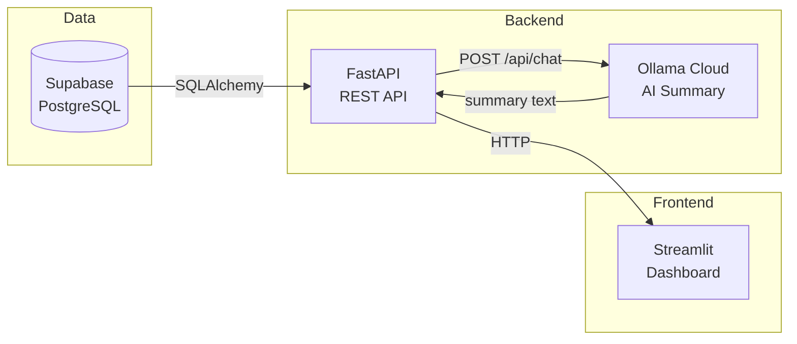
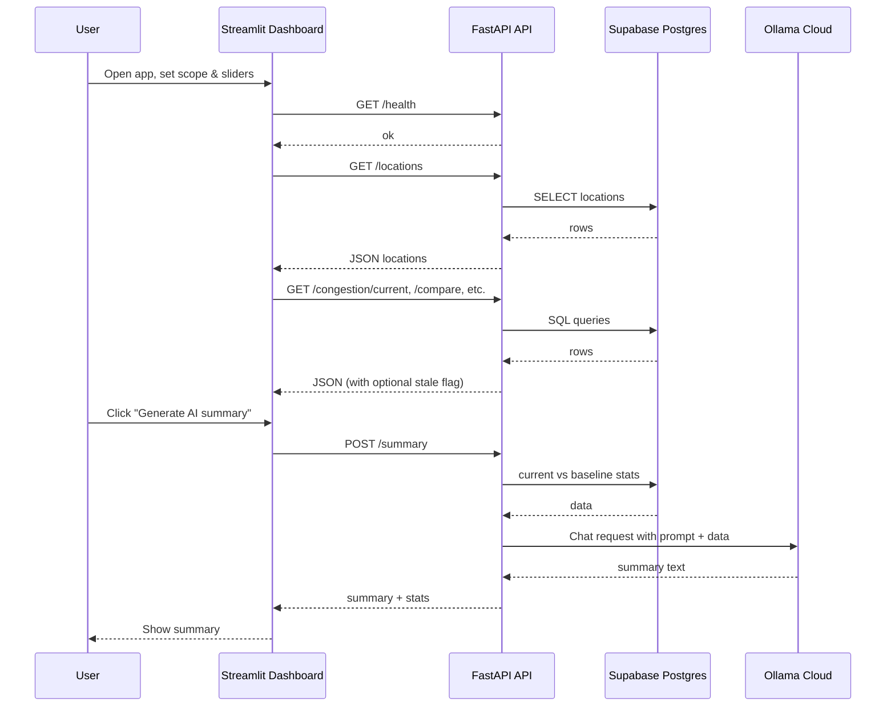
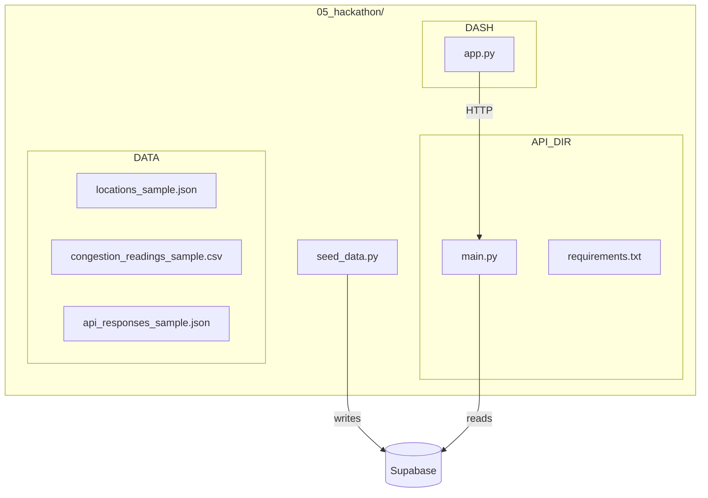

# 🚦 City Congestion Tracker

> **An AI-powered congestion dashboard that tracks road-segment and intersection congestion, compares current conditions to historical baselines, and generates operator-facing summaries via Ollama Cloud.**

This system stores synthetic congestion data in **Supabase PostgreSQL**, exposes it through a **FastAPI** REST API, and provides a **Streamlit** dashboard. The dashboard never talks to the database or Ollama directly—only to the API. AI summarization is performed by the API using Ollama Cloud.

📚 **Data definitions and variable descriptions** → [CODEBOOK.md](CODEBOOK.md)

---

## 📋 Table of Contents

- [System Architecture](#-system-architecture)
- [Setup Instructions](#-setup-instructions)
- [Usage](#-usage)
- [API Reference](#-api-reference)
- [Troubleshooting](#-troubleshooting)

---

## 🏗️ System Architecture

### High-Level Flow



⚠️ **Rules:** Only the **API** connects to the database (`DATABASE_URL`) and to Ollama Cloud (`OLLAMA_API_KEY`). The dashboard uses only `API_URL` and optional `CONNECT_API_KEY` for Posit Connect auth.

### Component Interaction



### Repository Layout



---

## 🚀 Setup Instructions

### Prerequisites

- ✅ Python 3.10+
- ✅ Supabase project
- ✅ (Optional) Ollama Cloud API key for AI summary
- ✅ (Optional) Posit Connect account for deployment

### 1️⃣ Clone and Install

From the repository root:

```bash
cd 05_hackathon
pip install -r api/requirements.txt
pip install -r dashboard/requirements.txt
```

### 2️⃣ Environment Variables

Create a **`.env`** file in `05_hackathon/` (or set in Posit Connect for deployed apps). **Do not commit `.env`.**

| Variable | Where | Description |
|----------|--------|-------------|
| 🔗 `DATABASE_URL` | API only | Supabase Postgres URL. Use the **connection pooler** URL (port 6543) for Posit Connect. |
| 🤖 `OLLAMA_API_KEY` | API only | Ollama Cloud API key (required for AI summary). |
| 🌐 `OLLAMA_URL` | API only | Optional; default `https://ollama.com/api/chat`. |
| 📦 `OLLAMA_MODEL` | API only | Optional; default `gpt-oss:20b-cloud`. |
| 🔌 `API_URL` | Dashboard only | Base URL of the API (e.g. `http://127.0.0.1:8000` locally). |
| 🔑 `CONNECT_API_KEY` | Dashboard on Connect | Posit Connect Publisher API key if the dashboard calls the API on Connect. |

### 3️⃣ Database and Seed Data

1. In **Supabase**, create the tables if they do not exist (see [CODEBOOK.md](CODEBOOK.md) for the SQL).
2. From `05_hackathon/` run:

```bash
python seed_data.py
```

✅ You should see: `Inserted N congestion readings.` and `Done. Refresh the Supabase Table Editor to see the data.`

### 4️⃣ Run Locally

**Terminal 1 — API:**

```bash
cd 05_hackathon
uvicorn api.main:app --reload --app-dir .
```

**Terminal 2 — Dashboard:**

```bash
cd 05_hackathon
streamlit run dashboard/app.py
```

🌐 Open the URL shown (e.g. `http://localhost:8501`). Ensure `API_URL` points to the API (e.g. `http://127.0.0.1:8000`).

### 5️⃣ Deploy to Posit Connect (Optional)

1. Set `CONNECT_SERVER` and `CONNECT_API_KEY` in `.env`.
2. Deploy API: `bash 05_hackathon/api/pushme.sh` from repo root.
3. In Connect, set the **API** app’s **Vars:** `DATABASE_URL`, `OLLAMA_API_KEY` (and optionally `OLLAMA_URL`, `OLLAMA_MODEL`).
4. Deploy dashboard: `bash 05_hackathon/dashboard/pushme.sh`.
5. Set the **dashboard** app’s **Vars:** `API_URL` = API content URL, `CONNECT_API_KEY` = Publisher key.

📄 Full steps and troubleshooting → **[DEPLOY_POSIT_CONNECT.md](DEPLOY_POSIT_CONNECT.md)**

---

## 📖 Usage

### Sidebar

1. **Scope** — Choose **All locations**, **Area**, or **Single location** and pick area/location if needed.
2. **Sliders** — Set current window (minutes), history (hours), pattern (days), compare window (hours), baseline (days), and top N for summaries.

### Tabs

| Tab | What it shows |
|-----|----------------|
| 📸 **Current Snapshot** | Worst congestion in the current (or last-available) window; shows a notice if data is stale. |
| 📈 **Location History** | Time series for one location. |
| 📊 **Typical Daily Pattern** | Hour-of-day averages. |
| ⚖️ **Current vs Usual** | Current vs historical baseline; notice if stale. |
| 🤖 **AI Summary** | Click **Generate AI summary** to get an operator-facing summary from Ollama Cloud (requires `OLLAMA_API_KEY` on the API). |

---

## 🔌 API Reference

| Method | Path | Description |
|--------|------|-------------|
| GET | `/health` | Liveness; returns `{ "status": "ok" }`. |
| GET | `/locations` | List all locations. |
| GET | `/congestion/current` | Current (or last-available) window; query params: `minutes`, `limit`. Returns `rows`, `stale`, `data_as_of`. |
| GET | `/congestion/history` | Time series for one location; params: `location_id`, `hours`. |
| GET | `/congestion/pattern` | Hour-of-day pattern; params: `days`, optional `location_id`, `area`. |
| GET | `/congestion/compare` | Current vs baseline; params: `window_hours`, `baseline_days`, optional `location_id`, `area`. |
| POST | `/summary` | AI summary; body: `SummaryRequest` (window_hours, baseline_days, top_n, optional area/location_ids). |

📚 **Response shapes and field definitions** → [CODEBOOK.md](CODEBOOK.md)

🖥️ **Interactive docs:** When the API is running, open `http://<API_URL>/docs` (Swagger UI).

---

## 🔧 Troubleshooting

| Issue | Action |
|-------|--------|
| ❌ **"DATABASE_URL is not configured"** | Set `DATABASE_URL` in the API’s environment (e.g. Connect Vars). Use Supabase **pooler** URL (port 6543) when deploying. |
| ⚠️ **"No current congestion data" / empty tabs** | Re-run `seed_data.py` so the last 30 days of synthetic data extend to “now”. Or rely on the fallback (stale notice). |
| 🔒 **401 on dashboard when calling API on Connect** | Set `CONNECT_API_KEY` on the **dashboard** app in Connect to the same Publisher key. |
| 🤖 **500 on POST /summary** | Set `OLLAMA_API_KEY` on the **API** app (Connect Vars or `.env`). |
| 🌐 **Network unreachable to Supabase** | Switch to the Supabase connection **pooler** URL (e.g. `aws-0-us-east-1.pooler.supabase.com:6543`). |

---

*City Congestion Tracker — Supabase + FastAPI + Streamlit + Ollama Cloud*

← 🏠 [Back to Top](#-city-congestion-tracker)
