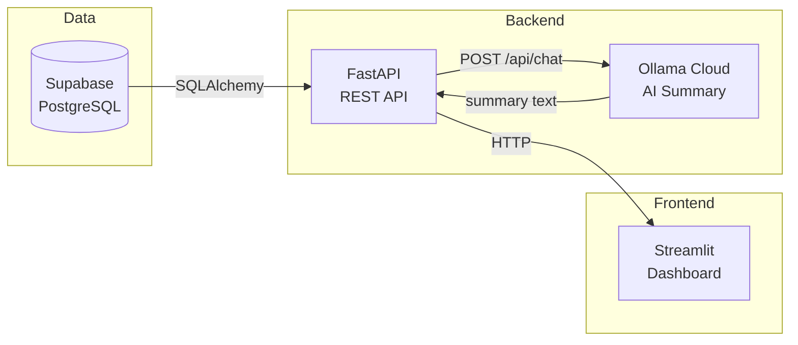
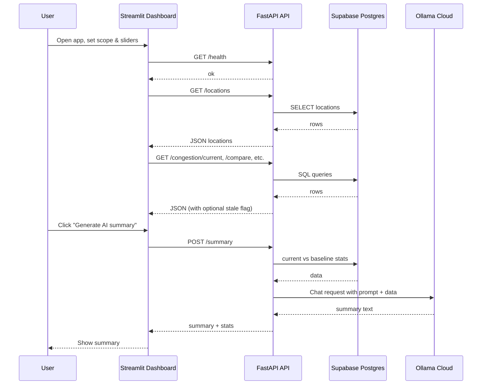
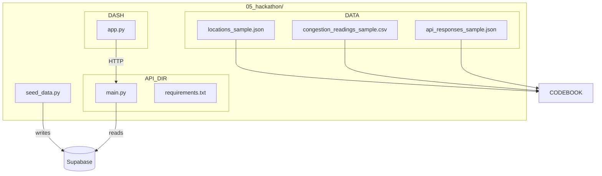
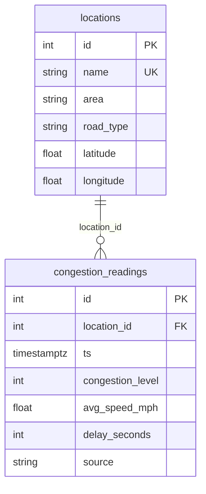

# City Congestion Tracker

> **An AI-powered congestion dashboard that tracks road-segment and intersection congestion, compares current conditions to historical baselines, and generates operator-facing summaries via Ollama Cloud.**

This system stores synthetic congestion data in **Supabase PostgreSQL**, exposes it through a **FastAPI** REST API, and provides a **Streamlit** dashboard. The dashboard never talks to the database or Ollama directly—only to the API. AI summarization is performed by the API using Ollama Cloud.

---

## Table of Contents

- [System Architecture](#-system-architecture)
- [Database Schema and Data Structure](#-database-schema-and-data-structure)
- [Data Summary and Codebook](#-data-summary-and-codebook)
- [Test Datasets](#-test-datasets)
- [Setup Instructions](#-setup-instructions)
- [Usage](#-usage)
- [API Reference](#-api-reference)
- [Troubleshooting](#-troubleshooting)

---

## System Architecture

### High-Level Flow



**Rules:** Only the API connects to the database (`DATABASE_URL`) and to Ollama Cloud (`OLLAMA_API_KEY`). The dashboard uses only `API_URL` and optional `CONNECT_API_KEY` for Posit Connect auth.

### Component Interaction



### Repository Layout



---

## Database Schema and Data Structure

### Entity Relationship



### Table Definitions

| Table | Purpose |
|-------|---------|
| **`public.locations`** | One row per road segment or intersection. Identified by `name` (unique). |
| **`public.congestion_readings`** | Time-series readings per location: congestion level (0–100), speed, delay, timestamp. |

**Recommended indexes** (for recent-window and per-location queries):

- `congestion_readings (ts DESC)`
- `congestion_readings (location_id, ts DESC)`
- `congestion_readings (congestion_level DESC)`

### SQL for Schema (Supabase)

Run in the Supabase SQL editor if tables do not exist:

```sql
-- Locations: road segments or intersections
CREATE TABLE IF NOT EXISTS public.locations (
    id         SERIAL PRIMARY KEY,
    name       TEXT UNIQUE NOT NULL,
    area       TEXT NOT NULL,
    road_type  TEXT NOT NULL,
    latitude   DOUBLE PRECISION NOT NULL,
    longitude  DOUBLE PRECISION NOT NULL
);

-- Congestion readings (time-series)
CREATE TABLE IF NOT EXISTS public.congestion_readings (
    id                SERIAL PRIMARY KEY,
    location_id       INTEGER NOT NULL REFERENCES public.locations(id),
    ts                TIMESTAMPTZ NOT NULL,
    congestion_level  INTEGER NOT NULL CHECK (congestion_level >= 0 AND congestion_level <= 100),
    avg_speed_mph     DOUBLE PRECISION NOT NULL,
    delay_seconds     INTEGER NOT NULL,
    source            TEXT NOT NULL DEFAULT 'synthetic'
);

CREATE INDEX IF NOT EXISTS idx_readings_ts ON public.congestion_readings (ts DESC);
CREATE INDEX IF NOT EXISTS idx_readings_location_ts ON public.congestion_readings (location_id, ts DESC);
CREATE INDEX IF NOT EXISTS idx_readings_congestion ON public.congestion_readings (congestion_level DESC);
```

---

## Data Summary and Codebook

### Data Summary

- **Locations:** 8 fixed segments/intersections across areas: Downtown, Midtown, West Side, Uptown, East Side, Harbor, Campus. Each has a congestion “bias” used when generating synthetic readings.
- **Congestion readings:** Synthetic data only. One reading every 15 minutes for the last 30 days. Patterns: rush-hour spikes (7–9 AM, 4–6 PM), lower weekend congestion, occasional event spikes, random noise. Metrics are consistent: higher congestion → lower speed, higher delay.
- **Staleness:** “Current” endpoints use a time window (e.g. last 60 minutes). If no data exists in that window, the API falls back to the most recent available window and sets `stale: true` and `data_as_of` so the UI can show a notice.

### Codebook — Data Files and Variables

#### 1. Locations (`public.locations` / [`data/locations_sample.json`](data/locations_sample.json))

| Variable     | Type    | Description |
|-------------|---------|-------------|
| `id`        | integer | Primary key (auto-increment). |
| `name`      | string  | Unique location name (e.g. "1st Ave & Main St"). |
| `area`      | string  | Area or neighborhood (e.g. "Downtown", "Midtown"). |
| `road_type` | string  | `"intersection"` or `"segment"`. |
| `latitude`  | float   | WGS84 latitude. |
| `longitude` | float   | WGS84 longitude. |

#### 2. Congestion Readings (`public.congestion_readings` / [`data/congestion_readings_sample.csv`](data/congestion_readings_sample.csv))

| Variable          | Type    | Description |
|------------------|---------|-------------|
| `id`             | integer | Primary key. |
| `location_id`    | integer | Foreign key to `locations.id`. |
| `ts`             | datetime (UTC) | Timestamp of the reading. |
| `congestion_level` | integer | 0–100; higher = worse congestion. |
| `avg_speed_mph`  | float   | Average speed in mph. |
| `delay_seconds`  | integer | Delay in seconds. |
| `source`         | string  | Data source; seed script uses `"synthetic"`. |

#### 3. API Response Shapes ([`data/api_responses_sample.json`](data/api_responses_sample.json))

| Endpoint / field | Description |
|------------------|-------------|
| `GET /health` | `{ "status": "ok" }`. |
| `GET /locations` | Array of location objects (id, name, area, road_type, latitude, longitude). |
| `GET /congestion/current` | `{ "rows": [...], "stale": bool, "data_as_of": iso8601 \| null }`. Each row: location_id, name, area, avg_congestion, avg_speed_mph, avg_delay_seconds. |
| `GET /congestion/history` | Array of `{ ts, congestion_level, avg_speed_mph, delay_seconds }`. |
| `GET /congestion/pattern` | Array of `{ hour, avg_congestion, avg_speed_mph, avg_delay_seconds, sample_count }`. |
| `GET /congestion/compare` | Object with `window_hours`, `baseline_days`, `stale`, `overall`, `by_location`, `biggest_rises`, `biggest_drops`. |
| `POST /summary` | Request body: `window_hours`, `baseline_days`, `top_n`, optional `area` or `location_ids`. Response: `{ summary, stats, model }`. |

---

## Test Datasets

Three small datasets demonstrate structure and behavior:

| # | File | Purpose |
|---|------|--------|
| 1 | **[`data/locations_sample.json`](data/locations_sample.json)** | Same 8 locations as the seed script. Use to verify `/locations` shape or to feed tests. |
| 2 | **[`data/congestion_readings_sample.csv`](data/congestion_readings_sample.csv)** | Sample rows for `congestion_readings`: multiple locations, 15-minute timestamps. Shows variable definitions and value ranges. |
| 3 | **[`data/api_responses_sample.json`](data/api_responses_sample.json)** | Example responses for `/health`, `/locations`, `/congestion/current` (with fallback), and `/congestion/compare`. Use for client integration tests or documentation. |

**How to demonstrate the system:**

1. **Seed the database:** Set `DATABASE_URL` in `.env`, then run `python seed_data.py` from `05_hackathon/`. This creates the 8 locations and ~30 days of synthetic readings.
2. **Run API + dashboard locally:** Start the API (`uvicorn api.main:app --reload` from repo root with `05_hackathon` as cwd or path), then run `streamlit run dashboard/app.py`. Use the dashboard to open each tab and trigger `/congestion/current`, `/congestion/compare`, and **Generate AI summary** (POST `/summary`).
3. **Compare to samples:** Check that `/locations` matches the structure in `locations_sample.json`, and that current/compare responses align with `api_responses_sample.json` (field names and types).

---

## Setup Instructions

**Prerequisites:** Python 3.10+, Supabase project, (optional) Ollama Cloud API key and Posit Connect account.

### 1. Clone and Install

From the repository root:

```bash
cd 05_hackathon
pip install -r api/requirements.txt
pip install -r dashboard/requirements.txt
```

### 2. Environment Variables

Create a `.env` file in `05_hackathon/` (or set in Posit Connect for deployed apps). **Do not commit `.env`.**

| Variable | Where | Description |
|----------|--------|-------------|
| `DATABASE_URL` | API only | Supabase Postgres URL. Use the **connection pooler** URL (port 6543) for Posit Connect. |
| `OLLAMA_API_KEY` | API only | Ollama Cloud API key (required for AI summary). |
| `OLLAMA_URL` | API only | Optional; default `https://ollama.com/api/chat`. |
| `OLLAMA_MODEL` | API only | Optional; default `gpt-oss:20b-cloud`. |
| `API_URL` | Dashboard only | Base URL of the API (e.g. `http://127.0.0.1:8000` locally). |
| `CONNECT_API_KEY` | Dashboard on Connect | Posit Connect Publisher API key if the dashboard calls the API on Connect. |

### 3. Database and Seed Data

1. In Supabase, create the tables (see [SQL for Schema](#sql-for-schema-supabase) above) if they do not exist.
2. From `05_hackathon/` run:

```bash
python seed_data.py
```

You should see: `Inserted N congestion readings.` and `Done. Refresh the Supabase Table Editor to see the data.`

### 4. Run Locally

**Terminal 1 — API:**

```bash
cd 05_hackathon
uvicorn api.main:app --reload --app-dir .
```

Or from repo root: `uvicorn 05_hackathon.api.main:app --reload` (adjust module path as needed).

**Terminal 2 — Dashboard:**

```bash
cd 05_hackathon
streamlit run dashboard/app.py
```

Open the URL shown (e.g. `http://localhost:8501`). Ensure `API_URL` points to the API (e.g. `http://127.0.0.1:8000`).

### 5. Deploy to Posit Connect (Optional)

1. Set `CONNECT_SERVER` and `CONNECT_API_KEY` in `.env`.
2. Deploy API: `bash 05_hackathon/api/pushme.sh` from repo root.
3. In Connect, set the API app’s **Vars:** `DATABASE_URL`, `OLLAMA_API_KEY` (and optionally `OLLAMA_URL`, `OLLAMA_MODEL`).
4. Deploy dashboard: `bash 05_hackathon/dashboard/pushme.sh`.
5. Set the dashboard app’s **Vars:** `API_URL` = API content URL, `CONNECT_API_KEY` = Publisher key.

See **[DEPLOY_POSIT_CONNECT.md](DEPLOY_POSIT_CONNECT.md)** for full steps and troubleshooting.

---

## Usage

1. **Scope:** Choose “All locations”, “Area”, or “Single location” and pick area/location if needed.
2. **Sliders:** Set current window (minutes), history (hours), pattern (days), compare window (hours), baseline (days), and top N for summaries.
3. **Tabs:**  
   - **Current Snapshot** — Worst congestion in the current (or last-available) window; shows a notice if data is stale.  
   - **Location History** — Time series for one location.  
   - **Typical Daily Pattern** — Hour-of-day averages.  
   - **Current vs Usual** — Current vs historical baseline; notice if stale.  
   - **AI Summary** — Click “Generate AI summary” to get an operator-facing summary from Ollama Cloud (requires `OLLAMA_API_KEY` on the API).

---

## API Reference

| Method | Path | Description |
|--------|------|-------------|
| GET | `/health` | Liveness; returns `{ "status": "ok" }`. |
| GET | `/locations` | List all locations. |
| GET | `/congestion/current` | Current (or last-available) window; query params: `minutes`, `limit`. Returns `rows`, `stale`, `data_as_of`. |
| GET | `/congestion/history` | Time series for one location; params: `location_id`, `hours`. |
| GET | `/congestion/pattern` | Hour-of-day pattern; params: `days`, optional `location_id`, `area`. |
| GET | `/congestion/compare` | Current vs baseline; params: `window_hours`, `baseline_days`, optional `location_id`, `area`. |
| POST | `/summary` | AI summary; body: `SummaryRequest` (window_hours, baseline_days, top_n, optional area/location_ids). |

Interactive docs: when the API is running, open `http://<API_URL>/docs` (Swagger UI).

---

## Troubleshooting

| Issue | Action |
|-------|--------|
| **"DATABASE_URL is not configured"** | Set `DATABASE_URL` in the API’s environment (e.g. Connect Vars). Use Supabase **pooler** URL (port 6543) when deploying. |
| **"No current congestion data" / empty tabs** | Re-run `seed_data.py` so the last 30 days of synthetic data extend to “now”. Or rely on the fallback (stale notice). |
| **401 on dashboard when calling API on Connect** | Set `CONNECT_API_KEY` on the **dashboard** app in Connect to the same Publisher key. |
| **500 on POST /summary** | Set `OLLAMA_API_KEY` on the **API** app (Connect Vars or `.env`). |
| **Network unreachable to Supabase** | Switch to the Supabase connection **pooler** URL (e.g. `aws-0-us-east-1.pooler.supabase.com:6543`). |

---

*City Congestion Tracker — Supabase + FastAPI + Streamlit + Ollama Cloud*

← [Back to Top](#city-congestion-tracker)
