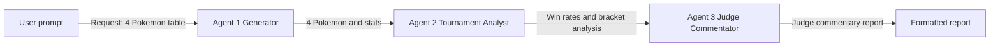
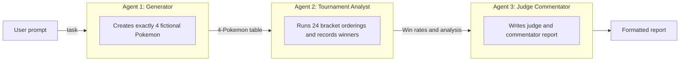
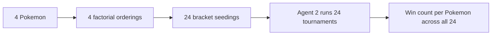
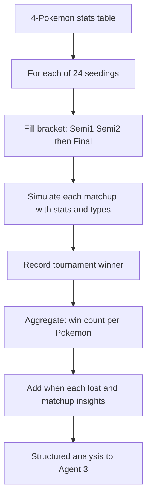
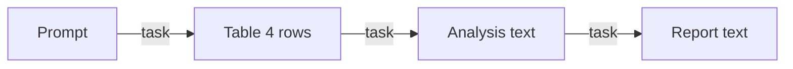

# Pokemon Tournament 3-Agent Workflow (Mermaid)

This document describes the synthetic-data 3-agent workflow using Mermaid diagrams. The pipeline generates 4 fictional Pokemon, runs a single-elimination tournament over every possible bracket seeding, and produces a judge/commentator-style report.

---

## 1. High-level flow

Information moves in one direction: User prompt → Agent 1 → Agent 2 → Agent 3 → Final report.

---

## 2. What each agent does

Each agent has a clear input and output; the table below is summarized in the diagram.

| Agent | Input | Output |
|-------|--------|--------|
| 1 Generator | User prompt (request 4 Pokemon) | Markdown table: name, type, HP, attack, defense |
| 2 Tournament Analyst | 4-Pokemon stats table | Win counts, when each won or lost, matchup notes |
| 3 Judge Commentator | Win rates and bracket analysis | Formatted report with verdict and commentator facts |

---

## 3. Why exactly 4 Pokemon?

The second agent tries **every possible route** (every way to seed the 4 Pokemon into the bracket). That means 4! = 24 orderings. More Pokemon would make this step very expensive.

---

## 4. Tournament step in detail

Agent 2 takes the 4 Pokemon and, for each of the 24 orderings, fills a single-elimination bracket, simulates matchups using stats and type logic, and records the winner.

---

## 5. End-to-end data flow (simplified)

A minimal view of what moves between agents.

In code: Agent 1 output becomes the `task` for Agent 2; Agent 2 output becomes the `task` for Agent 3 (e.g. using `agent_run(role=..., task=..., model=...)` in `functions.py`).
